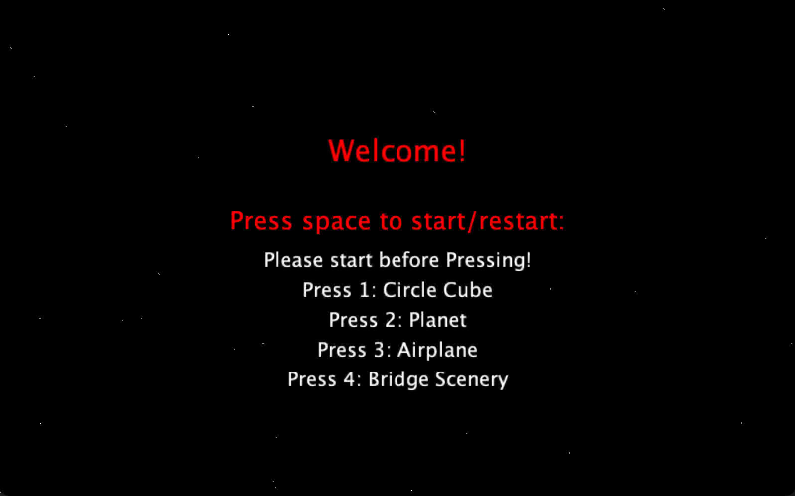

# Music Visualiser Project

Name: Kim Thai

Student Number: C19358373

# Description of the assignment
The Assignment I was given was to create "Something beautiful to enjoy while listening to music".

This is a music visualizer to the song "Raining All Summer" - Fragile lofi. There are four scenes for this assignment. I've used 3D and 2D shapes for this assignment which changes in size and colours. First One are a multiple circles and 2 cubes reacting to the music beat. Second one is a scene of the planet with rings rotating around it. The third one is an Airplane flying across buildings and lastly, this is a bridge scene with cars , moutains , sun and an audio band.
# Instructions
At The start you'll be greet to a menu screen. This will explain how the project works. You'll be greet with a Welcome and then list of keys that you would need to know to start the visualizer. To be able to start and restart the visualizer you will need to press the **spacebar key** , to change to different scenes you will need to hit the keys from **1 - 4.** 

Key 1 will show the Circles and 3D Cubes
Key 2 will show the Planet and Rings
Key 3 will show the Airplane Scene
Key 4 will show the Bridge Scene
# How it works
To be able to run this project you will need Visual Studio Code, and make sure that you have the relevant Java Libararies and Processing Libraries installed for this to be run properly. To start the project you will need to hit FN-f5 and then the program will run leading you to a welcoming screen.

The main file KimVisual.java is where everything is called for it to run and appear on the screen. Below is the code where I called it into the main file for it to run.

```Java
public class KimVisual extends Visual{
   
    CircleCube c;
    Planet p;
    Stars s;
    Airplane a;
    BridgeScene b;
    menu m;

}
```

The setup method below, are where the objects are created but also where the audio is getting called too.
```Java
public void setup()
    {
        // Call loadAudio to load an audio file to process 
        loadAudio("java/data/RAS.mp3");

        c = new CircleCube(this);
        p = new Planet(this);
        s = new Stars(this);
        a = new Airplane(this);
        b = new BridgeScene(this);
        m = new menu(this);
    }
```

Next, the keyPressed Method is where the user can start / restart the audio. If the user hits the space key they will be sent to the first music visual which is the Circle Cube.
```Java
public void keyPressed()
    {
        if (key >= '1' && key <= '4') {
            input = key - '0';
        }

        if (key == ' ')
        {
            if(ap.isPlaying()){
                ap.pause();
            } else {
                ap.rewind();
                ap.play();
            }
            start = true;
            input = 1;
        }
    }

```
Lastly, the draw methods is where everything is called for it to display on the screen. to be able to switch to different visuals using the keys 1 -4. I have used a switch statement. I put it in an if else statement to check if the user has started the audio already for it to be played, if they havent then they will be only welcomed to the menu screen giving them the instructions.
```Java
public void draw()
    if (start == false)
        {
           m.render(); 
           s.render();
        }
        else {
            switch(input)
            {
                case 1:
                {
                    c.render();
                    break;
                }
                case 2:
                {
                    p.render();
                    s.render();
                    break;
                }
                case 3:
                {
                    a.render();
                    s.render();
                    break;
                }
                case 4:
                {
                    b.render();
                    break;
                }
            }
        }

```

# What I am most proud of in the assignment
The part that i'm most proud of my assignment is the Bridge Scene, I spent the most time on this part of the assignment because I want to make sure that it was perfect and matches the colour palette that I was going for. It took me a while to draw the boat properly and to layout where everything goes. I've done alot of thinking of how to make this part of the assignment more aesthetically pleasing to the eyes of the users so when they listen to the audio everything matches the beat of it. 

I figured that making the sun and bubbles expand in size responding the the music makes it more pleasing to watch, to achieve this I had played around with the get amplitude method.I liked how the sun and the water moved to the beat of the music and also the Audio Bands behind the bridge. One part of the assignment that took me a bit longer to figure out was to make the cars boat respond outside of the frame of the window so that it doesn't look like they appeared out of nowhere, I wanted to make it look like they are in a loop.

# Images
Menu:


Key 1: Circle Cube


Key 2: Planet


Key 3: Airplane Scene


Key 4: Bridge Scene


# The Youtube Video
This is the Youtube [Video Link](https://www.youtube.com/watch?v=E1_bpTQQxz4&ab_channel=kimthai)